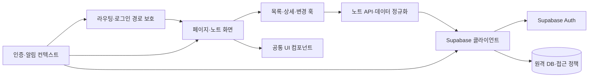

# 학습 노트 SPA

## 프로젝트 소개

React 18과 Supabase로 만든 학습 노트 관리 애플리케이션입니다. 노트 조회·검색·등록·수정·삭제와 로그인 상태에 따른 접근 제어를 제공합니다.

## 핵심 특징

- 제목·본문·분류 기반 검색과 고정 노트 표시
- Supabase 인증과 보호된 등록·수정·프로필 화면
- 재사용 가능한 입력·로딩·오류·빈 결과 컴포넌트
- 원격 데이터 조회와 변경을 전용 훅으로 분리
- Vercel 배포 시 SPA 경로를 복원하는 설정

## 아키텍처

`페이지 → 노트 기능 훅 → Supabase 클라이언트 → 원격 DB` 흐름입니다. 인증과 알림 상태는 컨텍스트에서 제공합니다. 화면의 보호 경로와 DB의 접근 정책은 각각 설정해야 합니다.

| 경로 | 역할 |
| --- | --- |
| `src/pages/` | 경로별 화면 |
| `src/features/notes/components/` | 노트 폼과 목록 |
| `src/features/notes/hooks/` | 목록·상세·변경의 React 상태 |
| `src/features/notes/api/` | Supabase 요청과 데이터 정규화 |
| `tests/` | 원격 요청을 모의한 저장소 계약 검증 |
| `src/components/ui/` | 도메인에 독립적인 공통 UI |
| `src/context/` | 인증·알림 상태 |
| `src/routes/` | 로그인 상태에 따른 경로 보호 |
| `src/lib/` | Supabase 연결과 입력 검증 |
| `docs/backend-setup.md` | 기존 노트 모델과 원격 서비스 준비 절차 |
| `package-lock.json` | 의존성 버전 잠금 |



## 실행 환경과 시작하기

Node.js 22와 npm을 사용합니다. `.nvmrc`를 사용하는 환경에서는 `nvm use`로 버전을 맞춥니다. 모든 명령은 저장소 루트에서 실행합니다.

```bash
npm ci
cp .env.example .env
# .env에 자신의 Supabase 프로젝트 설정을 입력합니다.
npm run dev -- --host 127.0.0.1
```

개발 서버 기본 주소는 `http://127.0.0.1:5173`입니다.

| 환경 변수 | 용도 |
| --- | --- |
| `VITE_SUPABASE_URL` | Supabase 프로젝트 주소 |
| `VITE_SUPABASE_PUBLISHABLE_KEY` | 브라우저에서 사용하는 공개 키 |

`VITE_` 변수는 빌드 결과에 포함됩니다. 관리자용 키는 넣지 않습니다. 테이블·인증·접근 정책 준비는 [백엔드 설정 안내](docs/backend-setup.md)를 따릅니다.

## 화면 경로

| 경로 | 기능 |
| --- | --- |
| `/` | 소개 |
| `/login` | 로그인 |
| `/notes` | 노트 목록과 검색 |
| `/notes/:id` | 상세 조회와 삭제 |
| `/notes/new` | 로그인 사용자 노트 등록 |
| `/notes/:id/edit` | 로그인 사용자 노트 수정 |
| `/profile` | 로그인 사용자 프로필 |
| 그 외 | 없는 페이지 안내 |

## 검증과 빌드

```bash
npm run lint
npm run format:check
npm test
npm run build
npm run preview -- --host 127.0.0.1
```

문서 검사까지 실행하려면 Python 3.10 이상과 Make를 준비하고 `make check`를 실행합니다. CI는 잠금 파일 설치, 정적 검사, Node 테스트, 빌드를 수행합니다. 실제 로그인·원격 DB 읽기·쓰기 검증은 자신의 Supabase 환경에서 수행합니다. 배포 환경에도 동일한 환경 변수를 설정하고 새로고침 시 상세 경로가 열리는지 확인합니다.

`make check`는 정적 분석·포맷·문서 검사를, `make test`는 `npm test`로 Node 내장 테스트 러너를 실행합니다. 테스트는 `tests/*.test.js`에 두며 실제 외부 요청을 모의합니다.
